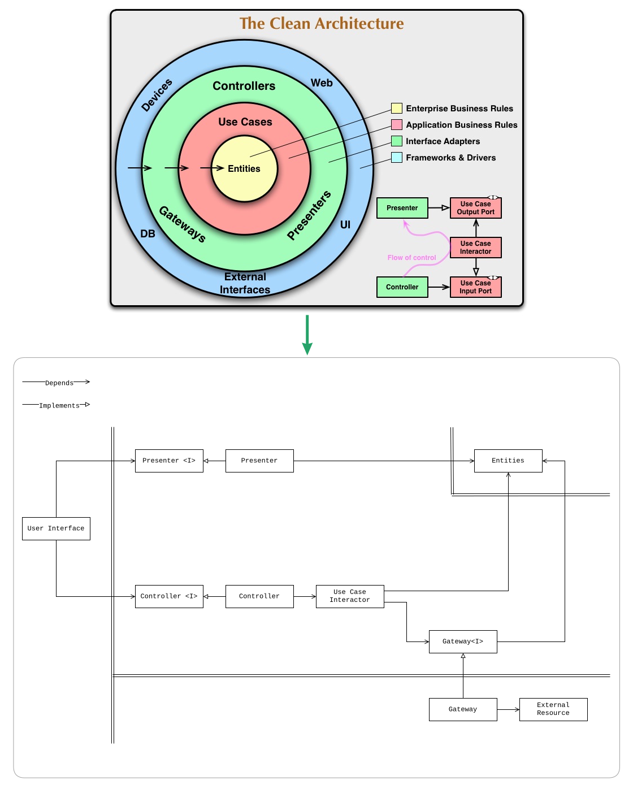

# Modern Architecture for Android

## Definition of units

- **Entities**: An aggregate unit that maintains a collection of enterprise
  business entities and/or application business entities and their states.
- **Use Case Interactor**: Unit that orchestrates the flow of data in the
  application by coordinating entities, gateways to fulfill specific user goals,
  implements application business rules.
- **Gateway**: Unit that isolates external resources by providing interfaces for
  data access, mapping data from external resources and potentially caching
  data.
- **Controller**: Unit that handles input data from the user interface and
  converts it into use case invocations.
- **Presenter**: Unit that transforms the application state into output data
  suitable for the user interface, often using selectors.
- **User Interface**: Unit that is responsible for displaying information to the
  user based on the data prepared by the presenter and for capturing user input
  and transferring it to the controller.
- **External Resource (Interface)**: External systems or services that the
  application interacts with, such as APIs, databases, storages, or other
  applications.

## Definition of concepts utilized by the units

- **Enterprise Business Entity**: Unit that encapsulates enterprise business
  rules and data.
- **Enterprise Business Rules and Data**: The most general and high-level rules
  and data that would exist even if the application didn't. These are
  enterprise-wide rules that rarely change and are independent of any specific
  application.
- **Application Business Entity**: Unit that encapsulates application-specific
  business rules and data.
- **Application Business Rules and Data**: Rules and data specific to the
  application's functionality and presentation. This includes how enterprise
  business concepts are presented to users, interaction flows, and
  application-specific behaviors. These are more likely to change compared to
  enterprise rules.
- **State**: The value of a entities at a given point in time, typically
  represented as an object structure.
- **Valid State**: One of a finite number of entity values that is conceptually
  considered valid according to business and application rules.

## TODO

- [ ] give idiomatic/consistent names to all the units/classes
- [ ] split code into separate files with idiomatic/consistent naming
- [ ] verify solution from technical perspective
