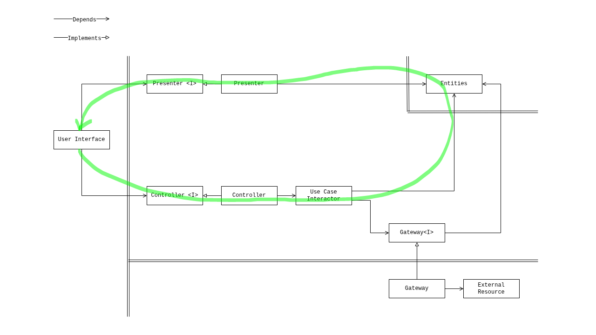
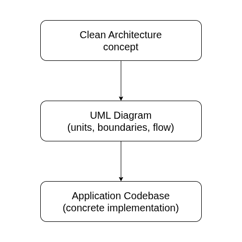
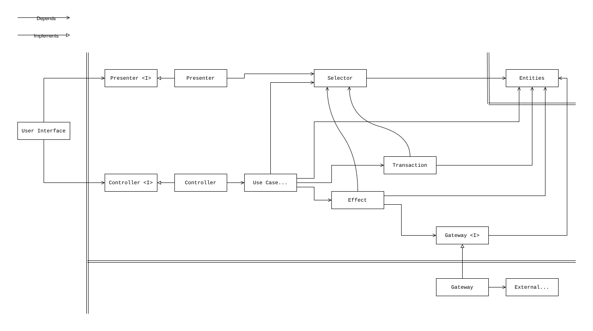

# Android Architecture Beyond MV* Patterns

:warning: The repository is only for technical assessment of the proposal. It
does not contain any technical patterns or solution, which can be followed or
reused. Work in progress.

## Features

* Just Clean Architecture approach without relying on MV* patterns
* Preserving the core benefits of Clean Architecture
* Reduced cognitive load when navigating large codebases
* Consistent unidirectional flow of control and data across the application
* Granular updates/rerenders of user interfaces.
* Prevention of "prop drilling" / "props walls" / logic distributed throughout
  layouts

**AI related**

* Manageable AI-assisted development throughout formalized architecture and
  development process
* Isolated contexts for both developers and AI agents
* Collective code ownership for developers and AI agents  

## Proposal 

Architectural concept:

- *Clean Architecture outlined with a specific UML diagram*

Development methodology (optional):

- *Continuous refactoring* <br/>
- *Outside-in/Top-down/Bottom-up development*

Basic codebase evolution scenario (optional): 

*Implementation starts from a single file and formally evolves into a fully
decomposed/structured codebase.*

Basic flow of a feature implementation (optional):

1. User Interface (layout)
2. Presenter\<I\> and Controller\<I\>
3. Entities
4. Presenter
5. Controller
6. Gateway\<I\>
7. External Resource 
8. Gateway

## Details on the Architectural Concept
Since the introduction of the Jetpack Compose framework the Android/Kotlin apps
have joined the family of reactive applications, which depend on the
observer pattern. At the same time, the current three-layer architecture and the
Android/Kotlin framework is still utilizing legacy artifacts from the previous
technical generation (e.g. ViewModel, MV* patterns).

However, with the technical movement there is a room for the architectural
improvement. Not a revolution, but evolution. The next generation architecture
may be built based on the Clean Architecture concept solely and outlined with
the following diagram:


### Definition of units

- **Entities**: An aggregate unit that maintains a collection of enterprise
  business entities and/or application business entities and their states.
- **Use Case Interactor**: Unit that orchestrates the flow of data in the
  application by coordinating entities and gateways to fulfill specific user
  goals, implements application business rules.
- **Gateway**: Unit that isolates external resource (interface) by providing
  interfaces for data access, adapting data from external resources.
- **Controller**: Unit that handles input data from the user interface and
  converts it into use case invocations.
- **Presenter**: Unit that transforms the application state into output data
  suitable for the user interface.
- **User Interface**: Unit that is responsible for displaying information to the
  user based on the data prepared by the presenter and for capturing user input
  and transferring it to the controller.
- **External Resource (Interface)**: External systems or services that the
  application interacts with, such as APIs, databases, storages, or other
  applications/libraries with API.

### Definition of concepts utilized by the units

- **Enterprise Business Entity**: Unit that encapsulates enterprise business
  rules and data.
- **Enterprise Business Rules and Data**: The most general and high-level rules
  and data that would exist even if the application didn't. These are
  enterprise-wide rules that rarely change and are independent of any specific
  application.
- **Application Business Entity**: Unit that encapsulates application-specific
  business rules and data.
- **Application Business Rules and Data**: Rules and data specific to the
  application's functionality. This includes how enterprise business concepts
  are presented to users, interaction flows, and application-specific behaviors.
  These are more likely to change compared to enterprise rules.
- **State**: The value of entities at a given point in time, typically
  represented as an object structure.
- **Valid State**: One of a finite number of entity values that is conceptually
  considered valid according to business and application rules.

The double lines on the diagram represent boundaries, which data crosses as
primitive data types or data structures, for example DTOs or plain objects.

Unidirectional flow of control and data is the following:



User's action/input is captured by the `controller` unit and a reaction comes
from the `presenter` unit. There is no intermediate unit (between the `user
interface` and the `entities` units), where the flow crosses itself and the
connection between two units becomes bidirectional (e.g.
`ViewModel(stateful)<->Composable(stateful)`). 

<details>
  <summary><b>Where did this diagram come from?</b></summary>

The Clean Architecture is a formalized architectural concept for application
software. The most overlooked factor here is that the implementation of the
Clean Architecture is an UML diagram. The concept itself is too abstract,
while codebase is too concrete. And an UML diagram bridges that.



For a typical backend application written in Java, a well-known Clean
Architecture implementation has existed for years


*Clean Architecture. A craftsman’s guide to software structure and design.
Robert C. Martin. Copyright © 2018 Pearson Education, Inc.*

However, this implementation does not directly apply to reactive applications.
Attempts to use it introduce code solely for adapting it. Nevertheless, the
Clean Architecture concept is universal and an implementation tailored for a
reactive application, for example with API integration, can be as this:


</details>

<details>
  <summary>
    <b>How does it scale?</b>
  </summary>

As codebase grows, it will obviously need more units to share common logic.
Following the Clean Architecture concept, the UML diagram may be extended with
additional units, the same way as the circular diagram of the concept may be
extended with additional circles. Harmony is maintained.

Extended diagram is the following:



The diagram represents units which are empirically sufficient for quite big
codebase.

### Definition of additional units

- **Selector**: Unit that derives values or aggregates data structures from
  the entities without modifying it.
- **Transaction**: Unit that transitions entities between two valid states,
  ensuring business rules are maintained.
- **Effect**: Unit that is responsible for encapsulating logic of interaction
  with gateways.

Worth to mention a specific unit - **repository**. The repository is a unit
which is a composite of the `gateway` and `entities` units. It implements the
`gateway<I>` and depends (has) `entities`.

</details>

<details>
  <summary><b>Are the SOLID principles followed?</b></summary>

The implementation of the Clean Architecture concept follows the SOLID
principles. The SOLID Principles are practical here.

1. *The single-responsibility principle (SRP)*. Each unit of the implementation
   has its own and only one well-defined responsibility.

2. *The open–closed principle (OCP)*. The principle is preserved by
   explicitly declared `presenter<I>`, `controller<I>` and `gateway<I>`
   interfaces. For example, the `user interface` unit is considered closed
   when the `presenter<I>` and `controller<I>` interfaces are declared. At the
   same time it remains open for extension (composition) - it can be rendered
   with other `user interface` units, by utilizing mocks through the LSP.

3. *Liskov substitution principle (LSP)*. The principle is preserved by
   explicitly declared `presenter<I>`, `controller<I>` and `gateway<I>`
   interfaces. For example, through the `gateway<I>` interface, different
   gateway implementations can be provided, which may represent remote or
   local resource.

4. *Interface segregation principle (ISP)*. The principle is preserved by
   explicitly declared `presenter<I>`, `controller<I>` and `gateway<I>`
   interfaces. For example, thick interfaces can signal the need to split an
   `unit interface` unit into parts, and the interfaces can also be used to
   understand/define these parts.

5. *Dependency inversion principle (DIP)*. The principle is preserved by
   explicitly declared `gateway<I>` interfaces. Units from inner layers do not
   depend on concrete implementation of units from outer layers, instead they
   depend on abstractions. For example, the `usecase` unit (inner layer) depends
   on the `gateway` unit (outer layer) through the `gateway<I>` interface.

</details>

<details>
  <summary>
    <b>What cognitive load has been referenced here?</b>
  </summary>

Below are several improvements related to the cognitive load I do observe in
practice.

1. The architecture (specifically the UML diagram) builds a detailed mental
   model of a system at any level (from all-in-one-composable to the entire
   application). Looking at lines of code, units, mapping them to the
   architecture one can quickly get their
   purpose/boundaries/relations/direction-of-the-control-flow.

2. No worries/struggles on factoring/refactoring, the architecture assists
   you (okay, these guys map data into what the user interface (layout) needs -
   it is the presenter; okay, these guys orchestrate application flow - it is the
   usecase, and so on).

3. Incremental development process out of the box. Architecture assists on
   splitting work into independent chunks, supporting trunk-based development.
   Units can be implemented and merged one-by-one (okay, this usecase is 
   complex - implement it, test it and merge, move to the next).

4. Focus only on one unit at a time (what a relief). While working on a user
   interface (layout), you do not need to keep all the system in your head, all
   focus is on the layout and its responsibilities. Or, when implementing a
   usecase, you focus only on one specific application flow.

5. Any cognitive load related to the collective code ownership (e.g. my code -
   your code, handover of a mid-developed feature in case of sick leave, vacation,
   etc.)

6. Any cognitive load related to prediction/modeling. A developer can start
   implementing the `user interface` unit first and use the `presenter<I>` and
   `controller<I>` interfaces to support entities modeling. At the same time, the
   developer has a detailed understanding of the feature and has the `user
   interface` unit done.

7. You just don't care about anything behind the gateway interface, it is a detail
   and can be done independently. Integration is a leaner process.

8. The testing pyramid now has better mapping to the codebase. Unit tests -
   are tests of the architectural units, integration tests - are tests of the
   integrated architectural units, e2e tests - are tests of the architectural
   units from the user interface to the gateway (or even a unit which represents
   external resource (interface)). 

</details>

## Details on Development Methodology

Developers and development teams may apply any preferred development
methodology, however I would suggest two main practices.

### Continuous refactoring

With the UML diagram developers have a blueprint how the system should be
structured. But in practice I observe several common pitfalls: premature
abstractions and introduction of separate files per unit upfront.

Instead, any related logic may remain inlined to keep the codebase simple at
first. The units may be extracted later as needed (e.g. to be reused, to be
tested, too big), the UML diagram helps.

The process of continuous refactoring is formalized by B. Meyer in his paper 
[The new culture of Software Development Reflections on the Practice of Object-Oriented Design](https://www.researchgate.net/publication/242361456_The_new_culture_of_Software_Development_Reflections_on_the_Practice_of_Object-Oriented_Design)

The process is called `The cluster model of software development`. In short:
each feature/module (cluster) is going through four mandatory steps:

```console
1. Specification -> 2. Design / Implementation -> 3. Validation -> 4. Generalization
```

Generalization is an effort involved in transforming program elements into
reusable software components.

> Developers should keep in mind that, even though the process is formalized, the
> generalization is not completely mechanical, decision to create a commonality
> should be driven by the broader context, including the application’s evolution
> and business roadmap.

Another practical aspect of the process is to have any feature done quickly
from scratch or by copy/pasting bits/units from other features with later
generalization of commonalities.

See also:

Kent C. Dodds. [AHA programming](https://kentcdodds.com/blog/aha-programming)
 
### Outside-in/Top-down/Bottom-up development

The practice defines directions of an application development. At high level
the development process is `outside-in`. The implementation starts from a unit
a user will interact with (the `user interface` unit), then the implementation
continues through the entire application (through the layers and levels of
abstraction).

The implementation of the `user interface` unit is made `top-down`: create a
single large layout, which covers feature requirement, then decompose it into
smaller reusable parts. An additional methodology can be applied here, so the
parts can be easily (from layout perspective) reused/composed back into something new
(e.g. new screen).

The implementation of inner units and abstractions (e.g Presenter, Controller,
Entities, Usecases, etc) is made `bottom-up`: create common abstractions/units
based on the existing declarations/implementation.

Basic flow of a feature implementation:

1. User Interface (layout)
2. Presenter\<I\> and Controller\<I\>
3. Entities
4. Presenter
5. Controller
6. Gateway\<I\>
7. External Resource 
8. Gateway

See also: 

Freeman, S., & Pryce, N. (2009). [Growing object-oriented software, guided by tests. Addison-Wesley Professional](https://www.amazon.com/Growing-Object-Oriented-Software-Guided-Tests/dp/0321503627)

E. Bache. [Outside-In development with Double Loop TDD](https://coding-is-like-cooking.info/2013/04/outside-in-development-with-double-loop-tdd/)

React.dev [Thinking in React](https://react.dev/learn/thinking-in-react)

D. Abramov. [Presentational and Container Components](https://medium.com/@dan_abramov/smart-and-dumb-components-7ca2f9a7c7d0)


## TODO

- [ ] verify solution from technical perspective
- [ ] identify technical gap between existing framework and the architectural
      proposal (as a source for the framework improvement)
- [ ] split the code into separate files with idiomatic/consistent naming
